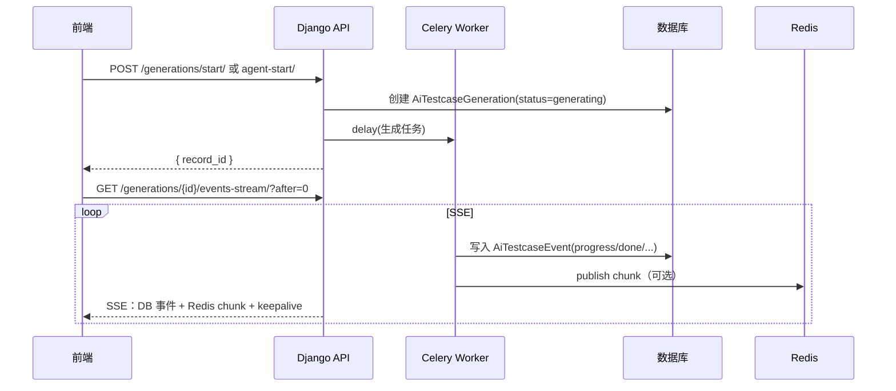

# AI 用例生成（P2）架构与业务流程

本文描述当前仓库中 **AI 用例生成** 模块在 **P2 改造**（任务队列化、事件持久化、SSE、多模型路由、质量闭环）后的 **分层架构** 与 **端到端业务流程**。实现主要分布在：

- 后端：`backend/apps/ai_testcase/`（`views.py`、`tasks.py`、`workflows/`、`services/model_router.py`、`models.py`）
- 前端：`frontend/src/restful/api.js`、`frontend/src/pages/workmind/ai_testcase/AiTestcaseGenerator.vue`
- 路由：`backend/apps/ai_testcase/urls.py`

---

## 1. 分层架构

| 层级 | 技术 | 作用 |
|------|------|------|
| 前端 | Vue + `axios` / `fetch` | 先 `POST` 启动任务拿到 `record_id`，再 `GET` SSE 订阅进度与结果 |
| API / ASGI | Daphne + Django ASGI | 同步 DRF 视图与异步 SSE 视图并存；SSE 使用 `async` + `StreamingHttpResponse` |
| 应用层 | DRF `ViewSet` + 独立 function view | `start` / `agent-start` 写库并投递 Celery；`events-stream` 推送事件流 |
| 异步任务 | Celery（`work_queue`） | 承载长耗时 LLM 调用、写库、写入 `AiTestcaseEvent` |
| 实时通道 | Redis Pub/Sub | 仅推送 **chunk**（流式 token），不落库，减轻数据库压力并降低延迟 |
| 持久化 | 数据库（PostgreSQL 等） | `AiTestcaseGeneration`（主记录）+ `AiTestcaseEvent`（可重放的进度事件） |
| 智能体 | LangGraph + `TestcaseModelRouter` | Agent 多节点工作流；按阶段选模型、成本估算与 Kimi/DeepSeek 回退 |

---

## 2. P2 核心业务流程（两段式）

前端不再使用「单连接长 SSE 完成全部生成」作为唯一路径，而是：

1. **启动**：`POST` 创建生成记录并入队 Celery，立即返回 `record_id`（及可选的幂等复用信息）。
2. **订阅**：`GET` SSE `events-stream`，按事件 id（`after` 游标）增量接收进度与终态。

**设计要点：**

- **启动与执行解耦**：HTTP 请求只负责「落任务 + 入队」，避免在 ASGI 工作线程中长时间占用连接执行 LLM。
- **进度与结果可观测**：结构化事件写入 `AiTestcaseEvent`；`after` 支持断线后从上次事件 id 继续（**chunk 为实时通道，不保证断线重放**）。
- **体感流式**：模型输出通过 Redis Pub/Sub 推到 SSE，避免每个 token 都写库。

---

## 3. 主要 API 一览

| 用途 | 方法 | 路径（前缀以项目 `api/ai_testcase/` 为准） |
|------|------|---------------------------------------------|
| 启动 Direct 任务 | POST | `generations/start/` |
| 启动 Agent 任务 | POST | `generations/agent-start/` |
| 事件流 SSE | GET | `generations/<id>/events-stream/?after=<event_id>` |
| 生成记录 CRUD / 取消等 | REST | `generations/`（ViewSet，含 `cancel` 等） |

**认证**：启动与 SSE 需 JWT（`Authorization: Bearer <token>`）；SSE 也可按实现支持 Query 传 token（便于部分客户端）。

**限流**：对 ai_testcase 作用域的 DRF `ScopedRateThrottle`；**异步 SSE 视图**中限流须通过 `sync_to_async` 包装，避免在 async 上下文中同步访问 cache 触发 `SynchronousOnlyOperation`。

---

## 4. Direct 与 Agent 的差异

| 维度 | Direct（直连/灵感等） | Agent（智能体） |
|------|----------------------|-----------------|
| 启动接口 | `POST .../start/` | `POST .../agent-start/` |
| Celery 任务 | `run_ai_testcase_direct` | `run_ai_testcase_agent`（名称以 `tasks.py` 为准） |
| 业务逻辑 | 以单轮（或多模态）大提示为主 → 结构化结果校验 → XMind | LangGraph：`TestcaseAgentExecutor` 驱动多节点（分析、策略、分模块生成、合并评审、修订等） |
| 质量与成本 | 结果 schema 校验 + `TestcaseModelRouter` | 同上，并叠加 **评审分数**、迭代与 **quality_tier / force_strong_generate** 等策略升级 |

`AiTestcaseGeneration.generation_mode` 等字段用于区分模式并参与幂等键计算。

---

## 5. 数据模型与事件形态

- **`AiTestcaseGeneration`**：业务主表（需求文本、状态、`result_json`、XMind 路径、`current_stage` / `progress`、错误信息等）。
- **`AiTestcaseEvent`**：追加式事件（`event_type` + `payload`），供 SSE 按 `id` 游标增量读取。

**SSE 常见事件类型（示例）**：`hello`、`start`、`progress`、`chunk`（来自 Redis，非 DB）、评审相关、`done` / `error` / `cancelled`、`keepalive`、`eof` 等。具体以 `tasks.py` 与 `views.py` 中写入/转发逻辑为准。

---

## 6. 与其它接口的关系（并存）

路由中仍可能保留 **旧式单连接 SSE**（如 `generate-stream/`、`agent-generate-stream/` 等），与 P2 **start + events-stream** 属于不同调用方式。若前端已切换到 P2，主路径为：

`start` 或 `agent-start` → `events-stream`。

列表与详情仍通过 DRF **`generations`** 资源查询。

---

## 7. 运维依赖（跑通 P2 的最小集合）

- **ASGI 服务**（如 Daphne）：承载 DRF 与 SSE。
- **Celery Worker**：订阅 **`work_queue`**（与 `@shared_task(queue='work_queue')` 一致）。
- **Redis**：限流缓存、Pub/Sub chunk；若使用 Channels，可能同时作为 channel layer。
- **Celery Beat**（可选）：周期性任务（如事件清理 `cleanup_ai_testcase_events`），需按项目说明注册 `PeriodicTask`。

---

## 8. 小结

- **架构**：API 快速建单 + **Celery** 执行长任务 + **数据库**持久化事件 + **SSE** 聚合 DB 事件与 **Redis** 实时 chunk。
- **业务**：**Direct** 偏「一次大生成」；**Agent** 偏「多节点 LangGraph + 评审与质量闭环」，通过 **不同启动接口与 Celery 任务** 区分。

---

*文档版本：与仓库 P2 实现对应；若接口或事件类型有变更，请以代码为准并更新本节。*
