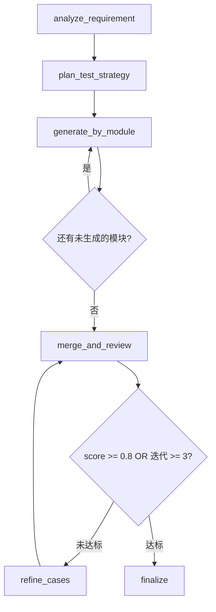

# 用例智能体改造完整方案

本文记录 `ai_testcase` 从"单次 LLM 调用工作流"改造为"LangGraph 自评审循环智能体"的完整过程，涵盖现状分析、智能体选型、方案设计、实现细节和前端可视化。

---

## 第一部分：现状分析

### 1.1 改造前的架构

改造前的 `ai_testcase` 是一个**线性工作流**：

```
用户输入需求 → 拼接 System Prompt → 单次调用 Kimi K2.5 API → 拿到原始文本
  → json.loads() 解析 → 存入 AiTestcaseGeneration 表 → 返回结果
```

对应代码调用链：

| 环节 | 文件 | 函数 |
|------|------|------|
| HTTP/SSE 入口 | `views.py` | `generate_stream_view()` |
| Prompt 组装 | `services/prompts.py` | `get_testcase_prompt()` |
| LLM 调用 | `services/kimi_client.py` | `generate_testcases_stream_async()` |
| 结果存储 | `models.py` | `AiTestcaseGeneration` |

### 1.2 为什么不是智能体

对照智能体的核心特征逐项检验：

| 智能体特征 | 改造前是否具备 | 说明 |
|---|---|---|
| **多步推理** | ❌ | 只有一次 LLM 调用，没有链式思考 |
| **自主决策** | ❌ | 不会根据需求复杂度调整生成策略 |
| **自评审/反思** | ❌ | LLM 返回什么就用什么，没有质量检查 |
| **反馈循环** | ❌ | 没有"不满意则修订"的机制 |
| **工具使用** | ❌ | 不会选择性地调用外部能力 |
| **状态管理** | ❌ | 无中间状态，无法暂停/恢复 |

**结论**：改造前是一个 **"LLM-as-a-Service"** 模式——把 LLM 当作一个黑盒翻译器，输入需求文本，输出 JSON 用例。和调一个翻译 API 没有本质区别。

### 1.3 改造前的痛点

1. **单次生成质量不稳定**：一次 Prompt 要求生成所有模块的全部用例，输入输出都很长，LLM 容易丢失细节、虎头蛇尾
2. **无质量保障**：无评审环节，用例覆盖率、优先级分布、命名一致性全靠 Prompt 设计的好坏
3. **不可控**：复杂需求和简单需求用同一个 Prompt，无法差异化处理
4. **全有全无**：整个生成是原子操作，中间某个模块质量差无法局部重试

---

## 第二部分：智能体选型分析

### 2.1 候选方案

| 方案 | 核心思想 | 典型框架 |
|------|----------|----------|
| **A. ReAct / Tool-Calling Agent** | LLM 自主决定调用什么工具、何时停止 | LangChain Agent, OpenAI Function Calling |
| **B. Multi-Agent（多智能体）** | 多个独立 Agent 各有目标，通过消息协作 | AutoGen, CrewAI, MetaGPT |
| **C. LangGraph StateGraph + 自评审循环** | 预定义流程图，节点间用 LLM 处理，路由由 LLM 输出驱动 | LangGraph |
| **D. DSPy 优化器** | 把 Prompt 当程序，用编译器自动优化 | DSPy |

### 2.2 选型评估

**方案 A（ReAct）不适合的原因**：

- 测试用例生成的流程是**确定的**（分析→策略→生成→评审→修订），不需要 LLM 自主选择下一步
- ReAct 模式下 LLM 可能在无关工具间反复跳跃，Token 消耗不可预测
- 输出格式要求严格 JSON，ReAct 的自由度反而是劣势
- 难以保证每次执行的可复现性

**方案 B（多智能体）不适合的原因**：

- 当前场景的角色边界不如 `ai_requirement`（PM/架构师/测试三个明确角色）那么清晰
- "需求分析专家"和"测试工程师"本质上是同一个 LLM 切换 System Prompt，不需要独立的记忆和通信机制
- 多智能体的协调开销（消息传递、冲突解决、状态同步）大于收益
- 增加系统复杂度，调试难度显著上升

**方案 D（DSPy）不适合的原因**：

- DSPy 主要解决 Prompt 优化问题，不是流程编排工具
- 当前阶段手写 Prompt + 自评审已经够用
- 可作为后续增强手段，但不是架构选型

**方案 C（LangGraph StateGraph）适合的原因**：

- ✅ 流程可预定义，但支持条件分支和循环
- ✅ 每个节点可以用不同的 System Prompt（模拟多角色）
- ✅ 状态在节点间流转，天然支持中间状态持久化
- ✅ 项目已有 `ai_requirement` 使用 LangGraph 的先例，团队有经验
- ✅ `requirements.txt` 中已安装 `langgraph` 和 `langgraph-checkpoint-sqlite`
- ✅ 自评审循环是 LangGraph 的经典模式，社区有大量最佳实践

### 2.3 选型结论

**采用方案 C：LangGraph StateGraph + LLM 驱动的自评审循环**。

这是一个**单智能体**架构（不是多智能体），通过在不同节点切换 System Prompt 实现**多角色单智能体**（Prompt Chaining Agent）。

### 2.4 与业界实践的对齐

| 业界模式 | 本方案的对应 |
|----------|-------------|
| **Self-Reflection Pattern**（OpenAI Cookbook 推荐） | `merge_and_review` 节点让 LLM 用评审专家角色审查自己的输出 |
| **Iterative Refinement**（LangChain 官方教程） | `refine_cases` → `merge_and_review` 的循环，带迭代上限保护 |
| **Plan-and-Execute**（LangGraph 文档推荐） | `analyze_requirement` + `plan_test_strategy` 先规划再执行 |
| **Map-Reduce**（大规模内容生成模式） | `generate_by_module` 将大任务拆成 N 个子任务独立执行后合并 |

本方案同时融合了以上四种模式，是"结构化内容生成 + 质量保障"场景下的业界主流做法。

---

## 第三部分：方案设计

### 3.1 改造后的架构

```
需求输入 → [analyze_requirement] 提取模块和复杂度
         → [plan_test_strategy] 为每个模块规划测试方法
         → [generate_by_module] × N  逐个模块独立生成用例
         → [merge_and_review] 合并全部用例 + LLM 评审打分
              ├─ score >= 0.8 → [finalize] 完成
              └─ score < 0.8  → [refine_cases] 自动修订 → 回到评审
```



### 3.2 核心设计决策

#### 决策 1：分模块生成替代一次性生成

| | 改造前 | 改造后 |
|---|---|---|
| 生成方式 | 1 次 LLM 调用生成全部用例 | N 次调用，每次只生成 1 个模块 |
| 单次 Prompt 长度 | 很长（全部需求 + 全部用例） | 较短（单模块需求 + 单模块策略） |
| 质量 | 后面的模块容易被忽略 | 每个模块同等对待 |
| 容错 | 整体失败 | 单模块失败可跳过 |

#### 决策 2：LLM 驱动的自评审闭环

评审不是简单的规则校验，而是让 LLM 以**评审专家**角色（与生成时的测试工程师角色不同）审查全部用例，输出量化分数和具体问题：

- 评分维度：覆盖率（40%）、质量（30%）、一致性（15%）、无冗余（15%）
- 路由逻辑：`score < 0.8 AND iteration < 3` → 修订
- 修订方式：增量变更指令（add_case / modify_case / delete_case），不是重新生成全部

#### 决策 3：迭代上限保护

自评审循环有失控风险（评审永远不满意→无限修订→Token 爆炸）。设置硬上限：

| 参数 | 默认值 | 说明 |
|---|---|---|
| `TESTCASE_AGENT_MAX_REVISIONS` | 3 | 最大修订轮次 |
| `TESTCASE_AGENT_REVIEW_THRESHOLD` | 0.8 | 评审通过阈值 |
| `TESTCASE_AGENT_MODULE_TIMEOUT` | 120s | 单节点超时 |
| `TESTCASE_AGENT_REVIEW_TIMEOUT` | 180s | 评审节点超时 |

### 3.3 状态定义

```python
class TestcaseAgentState(TypedDict, total=False):
    # 输入
    requirement: str          # 原始需求文本
    extracted_texts: list     # 附件提取的文字
    images: list              # 图片（base64）
    mode: str                 # 生成模式
    use_thinking: bool        # 是否启用思考模式

    # 分析结果
    requirement_analysis: dict  # {title, modules: [{name, complexity, key_rules, risk_areas}], global_rules, implied_rules}
    test_strategy: dict         # {strategies: [{module_name, methods, case_budget, coverage_targets}]}

    # 生成中间态
    modules_generated: list     # 已完成的模块用例列表
    current_module_index: int   # 当前生成到第几个模块
    generation_errors: list     # 生成失败的模块记录

    # 评审循环
    merged_result: dict         # 合并后的完整用例 JSON
    review_score: float         # 0-1 评审分数
    review_feedback: str        # 评审总结
    review_issues: list         # [{severity, type, description, suggestion}]
    iteration_count: int        # 当前迭代轮次

    # Token 累计
    total_usage: dict           # {prompt_tokens, completion_tokens, total_tokens}

    # 控制
    node_trace: list            # 每个节点的执行记录
    current_node: str           # 当前节点名
    is_complete: bool           # 是否完成
    error: str                  # 错误信息
```

### 3.4 各节点 Prompt 策略

| 节点 | 角色 | 输入 | 输出 | 模型 |
|------|------|------|------|------|
| analyze_requirement | 需求分析专家 | 原始需求 + 附件/图片 | `{title, modules, global_rules, implied_rules}` | kimi-k2.5 |
| plan_test_strategy | 测试架构师 | 分析结果 | `{strategies: [{module_name, methods, case_budget, coverage_targets}]}` | kimi-k2.5 |
| generate_by_module | 测试工程师 | 单模块策略 + 需求 + 全局规则 | 单模块用例 JSON `{name, functions: [{name, cases}]}` | kimi-k2.5 |
| merge_and_review | 评审专家 | 全部用例 + 需求 | `{score, summary, dimension_scores, issues}` | kimi-k2.5 (thinking=on) |
| refine_cases | 测试工程师 | 用例 + 评审反馈 | 增量变更指令 `{changes: [{action, module, ...}]}` | kimi-k2.5 |

评审节点启用思考模式（`use_thinking=True`），因为评审需要深度分析，而其他节点不需要。

---

## 第四部分：实现细节

### 4.1 文件变更清单

#### 新增文件（4 个）

| 文件 | 职责 |
|------|------|
| `workflows/__init__.py` | 导出 `get_testcase_agent_workflow` |
| `workflows/testcase_agent.py` | LangGraph StateGraph 定义（5 个节点 + 2 个路由函数），智能体核心 |
| `workflows/executor.py` | `TestcaseAgentExecutor`：驱动图异步执行、同步 DB 状态、SSE 事件推送 |
| `services/agent_prompts.py` | Agent 各节点专用 Prompt + 消息构建辅助函数 |

#### 修改文件（5 个）

| 文件 | 改动 |
|------|------|
| `models.py` | 新增 5 个字段：`generation_mode`, `agent_state`, `iteration_count`, `review_score`, `review_feedback` |
| `migrations/0003_agent_fields.py` | 对应的数据库迁移 |
| `services/kimi_client.py` | 新增 `run_validated_async()`（非流式 + JSON 校验 + 重试）；修复多模态重复请求 bug |
| `views.py` | 新增 `agent_generate_stream_view` 异步 SSE 视图 |
| `urls.py` | 注册 `agent-generate-stream/` 路由 |

#### 前端文件（2 个）

| 文件 | 改动 |
|------|------|
| `src/restful/api.js` | 新增 `aiAgentGenerateTestcaseStream()` SSE 调用函数 |
| `src/pages/workmind/ai_testcase/AiTestcaseGenerator.vue` | Agent 模式开关、五步进度条、结构化卡片展示、实时活动日志 |

### 4.2 LangGraph 图构建

```python
workflow = StateGraph(TestcaseAgentState)

# 添加 5 个节点
workflow.add_node('analyze_requirement', analyze_requirement_node)
workflow.add_node('plan_test_strategy', plan_test_strategy_node)
workflow.add_node('generate_by_module', generate_by_module_node)
workflow.add_node('merge_and_review', merge_and_review_node)
workflow.add_node('refine_cases', refine_cases_node)
workflow.add_node('finalize', finalize_node)

# 线性边
workflow.set_entry_point('analyze_requirement')
workflow.add_edge('analyze_requirement', 'plan_test_strategy')
workflow.add_edge('plan_test_strategy', 'generate_by_module')

# 条件边 1：模块循环
workflow.add_conditional_edges('generate_by_module', route_after_generate,
    {'generate_by_module': 'generate_by_module', 'merge_and_review': 'merge_and_review'})

# 条件边 2：评审循环
workflow.add_conditional_edges('merge_and_review', route_after_review,
    {'refine_cases': 'refine_cases', 'finalize': 'finalize'})

# 修订后回到评审
workflow.add_edge('refine_cases', 'merge_and_review')
workflow.add_edge('finalize', END)
```

### 4.3 KimiClient 增强：`run_validated_async()`

Agent 节点需要非流式调用 + JSON 解析 + 自动重试。新增的 `run_validated_async()` 方法：

1. 调用 Kimi API（非流式）
2. 解析返回内容为 JSON（使用 `json_repair` 容错）
3. 如果解析失败，将错误追加到对话中让 LLM 修正输出
4. 最多重试 2 次
5. 累计所有重试的 Token 消耗

与直接生成使用的流式方法（`generate_testcases_stream_async`）的区别：

| | 流式方法 | `run_validated_async` |
|---|---|---|
| 返回方式 | 逐 chunk yield | 等待完整响应 |
| JSON 校验 | 无（由 views.py 后处理） | 内置校验 + 重试 |
| 用途 | 直接生成模式（需要实时文字流） | Agent 节点（需要结构化数据） |

### 4.4 Executor：SSE 事件协议

`TestcaseAgentExecutor` 通过 `graph.astream()` 驱动 LangGraph 图执行，每个节点完成后推送 SSE 事件：

| 事件类型 | 触发时机 | 携带数据 |
|----------|----------|----------|
| `agent_start` | 工作流启动 | `record_id`, `nodes` |
| `agent_node_done` | 节点完成 | `node`, `index`, `total`, `data`（结构化数据） |
| `agent_review` | 评审完成 | `score`, `feedback`, `issues`, `iteration`, `max` |
| `agent_refining` | 进入修订 | `iteration`, `changes_count` |
| `agent_done` | 全流程完成 | `record_id`, `data`, `review_score`, `iterations`, `module_count`, `case_count`, `usage` |
| `error` | 出错 | `error`, `record_id` |
| `warnings` | 文件处理警告 | `warnings` |

每个 `agent_node_done` 事件的 `data` 字段包含该节点的结构化输出：

- `analyze_requirement`：模块列表、复杂度、关键规则
- `plan_test_strategy`：每个模块的测试方法、用例数范围
- `generate_by_module`：最新完成的模块名、功能点数、用例数、总进度
- `merge_and_review`：总模块数、总用例数
- `refine_cases`：变更数量

### 4.5 修复的已有 Bug

`kimi_client.py` 的 `generate_testcases_multimodal_stream_async()` 方法（原 243-273 行）存在**重复请求 bug**：同一段 `try-except` 块被复制粘贴了两次，导致每次多模态调用实际发出两次 LLM 请求，产生重复 chunk 和双倍 Token 消耗。已删除重复代码。

---

## 第五部分：前端可视化

### 5.1 交互入口

卡片头部新增 **「Agent 生成」开关**（`el-switch`），与「思考模式」并排：

- 关闭：走原有直接生成流程，按钮显示"智能生成用例"
- 开启：走 Agent 智能体流程，按钮显示"Agent 智能生成"

### 5.2 进度面板（方案 A：结构化卡片展示）

在流式输出面板上方新增 Agent 进度面板，包含：

1. **五步进度条**（`el-steps`）：需求分析 → 策略规划 → 分模块生成 → 评审打分 → 完成
2. **需求分析卡片**：彩色标签展示模块名 + 复杂度（绿色简单/默认中等/黄色复杂/红色关键）+ 全局规则
3. **策略规划表格**：`el-table` 展示模块名 / 测试方法标签 / 用例数范围 / 重点关注
4. **生成进度列表**：每个模块完成后追加一行（✅ 图标 + 模块名 + 功能点数 + 用例数）
5. **评审结果区**：分数徽章（绿色通过/红色未达标）+ 总体评价 + 具体问题列表（严重程度标签 + 描述）+ 修订动画

### 5.3 活动日志面板

将直接生成模式的"AI 正在生成..."流式文字面板替换为**结构化活动日志**：

```
12:35:01  🚀  Agent 工作流已启动
12:35:01  🔍  开始分析需求...
12:35:13  ✅  需求分析完成 — 识别到 3 个模块                    (12s)
12:35:13  📋  开始规划测试策略...
12:35:21  ✅  策略规划完成                                      (8s)
12:35:21  🔨  开始分模块生成用例...
12:35:38  ✅  模块「账号注册弹窗」完成 — 5 个功能点, 35 条用例    (17s)
12:35:38  🔨  继续生成下一个模块 (1/3)...
12:35:52  ✅  模块「用户头像下拉菜单」完成 — 3 个功能点, 12 条用例 (14s)
12:36:05  ✅  模块「新用户引导」完成 — 4 个功能点, 10 条用例       (13s)
12:36:05  📝  所有模块生成完毕，开始评审打分...
12:36:25  ⚠️  评审分数: 72分，未达标，将自动修订（第 1/3 轮）
12:36:25  🔧  根据评审意见修订用例（第 1 轮）...
12:36:40  🔧  修订完成，重新评审...                              (15s)
12:36:55  🎉  评审通过！分数: 86分
12:36:55  ✨  流程已完成
12:36:55  🏁  Agent 生成完成！3 个模块, 57 条用例 · 评审 86分 · 经过 1 轮修订
```

设计要点：
- 等待中的步骤有**闪烁动画**，用户随时知道系统在运行
- 每步完成显示**耗时**（灰色小字）
- 不同状态有**颜色区分**：绿色成功、黄色警告、红色错误、蓝色完成
- 等宽字体 + 自动滚动到底部
- 直接生成模式的原始文字流面板不受影响

### 5.4 两种模式的 UI 对比

| UI 区域 | 直接生成 | Agent 生成 |
|---------|---------|-----------|
| 按钮文字 | "智能生成用例" | "Agent 智能生成" |
| 进度面板 | 无 | 五步进度条 + 结构化卡片 |
| 内容面板 | 实时文字流（原始 AI 输出逐字显示） | 活动日志（结构化事件时间线） |
| 结果展示 | 生成完成后展示用例树 | 同左，额外展示评审分数和迭代次数 |

---

## 第六部分：迁移策略

### 6.1 零风险上线

1. `generation_mode` 字段默认 `'direct'`，不影响现有数据和查询
2. Agent 端点 `agent-generate-stream/` 独立于现有 7 个 SSE 端点，不修改任何现有代码
3. 前端通过开关选择模式，默认关闭 Agent 模式

### 6.2 向后兼容

| 现有功能 | 影响 |
|----------|------|
| 直接生成（generate-stream） | 无影响 |
| 模块重新生成（regenerate-module-stream） | 无影响 |
| 功能点重新生成（regenerate-function-stream） | 无影响 |
| 用例评审（review-stream） | 无影响 |
| 采纳评审（apply-review-stream） | 无影响 |
| 历史记录列表 | 新记录有 `generation_mode='agent'` 字段，可区分展示 |
| XMind 下载 | Agent 完成后同样生成 XMind 文件 |

### 6.3 后续演进方向

| 方向 | 说明 |
|------|------|
| 流式评审反馈 | 评审节点改为流式输出，用户实时看到评审过程 |
| 人工审批节点 | 评审后暂停等待人工确认，再决定修订或通过 |
| 按模块选模型 | 简单模块用快速模型，复杂/关键模块用更强的模型 |
| 需求智能体联动 | 从 `ai_requirement` 的功能点结构直接注入 Agent 的 `analyze_requirement` 节点 |
| Checkpoint 持久化 | 使用 `langgraph-checkpoint-sqlite` 保存图执行快照，支持断点续跑 |
| DSPy Prompt 优化 | 收集评审分数数据后，用 DSPy 自动优化各节点 Prompt |

---

## 附录

### A. 配置项

在 `settings.py` 中可配置以下参数（均有默认值）：

```python
TESTCASE_AGENT_MAX_REVISIONS = 3      # 最大自动修订轮次
TESTCASE_AGENT_REVIEW_THRESHOLD = 0.8  # 评审通过分数阈值（0-1）
TESTCASE_AGENT_MODULE_TIMEOUT = 120    # 单模块生成超时（秒）
TESTCASE_AGENT_REVIEW_TIMEOUT = 180    # 评审步骤超时（秒）
```

### B. API 接口

```
POST /api/ai_testcase/agent-generate-stream/
Content-Type: multipart/form-data 或 application/json

参数：
  requirement: string  — 需求描述（可选，但需求和文件至少提供一个）
  use_thinking: bool   — 是否启用思考模式（默认 false）
  mode: string         — 生成模式（comprehensive/focused，默认 comprehensive）
  files: File[]        — 上传的需求文档/UI 设计图（可选）

响应：text/event-stream（SSE）
```

### C. 数据库新增字段

```sql
ALTER TABLE ai_testcase_generation ADD COLUMN generation_mode VARCHAR(10) DEFAULT 'direct';
ALTER TABLE ai_testcase_generation ADD COLUMN agent_state JSON NULL;
ALTER TABLE ai_testcase_generation ADD COLUMN iteration_count INT DEFAULT 0;
ALTER TABLE ai_testcase_generation ADD COLUMN review_score FLOAT NULL;
ALTER TABLE ai_testcase_generation ADD COLUMN review_feedback TEXT NULL;
```
